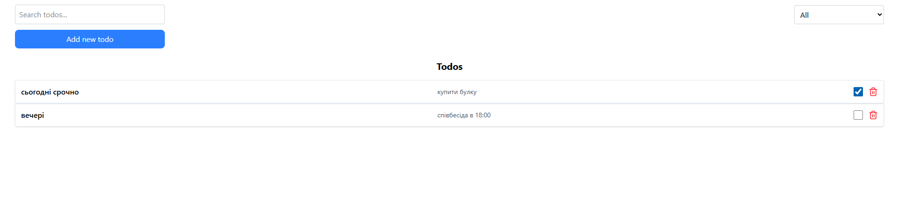

# Full-Stack Todo Application (NestJS + React)

Це повноцінний Full-Stack додаток для керування списком завдань. Проєкт побудований на сучасній архітектурі з чітким розділенням обов'язків (Separation of Concerns), типізацією на всіх рівнях та автоматизацією процесів.

## 🚀 Основні технології

- **Frontend:** React 19, TypeScript, Vite.
- **Backend:** NestJS, Prisma ORM, PostgreSQL.
- **Валідація:** Zod (фронтенд), class-validator (бекенд).
- **Стилізація:** Tailwind CSS.

## 🛠️ Встановлення та запуск

### Крок 1: Бекенд
1. Перейдіть у папку `cd backend`.
2. Встановіть залежності: `npm install`.
3. Створіть файл `.env` та додайте `DATABASE_URL`
4. Запустіть міграції: `npx prisma migrate dev`.
5. Запустіть сервер: `npm run start:dev`.

### Крок 2: Фронтенд
1. Перейдіть у папку `cd frontend`.
2. Встановіть залежності: `npm install`.
3. Запустіть додаток: `npm run dev`.

## 📐 Архітектура проєкту
Проєкт реалізований як монорепозиторій:
- `/back` — API з використанням модульної структури NestJS.
- `/front` — Клієнтська частина з кастомними хуками для бізнес-логіки.

